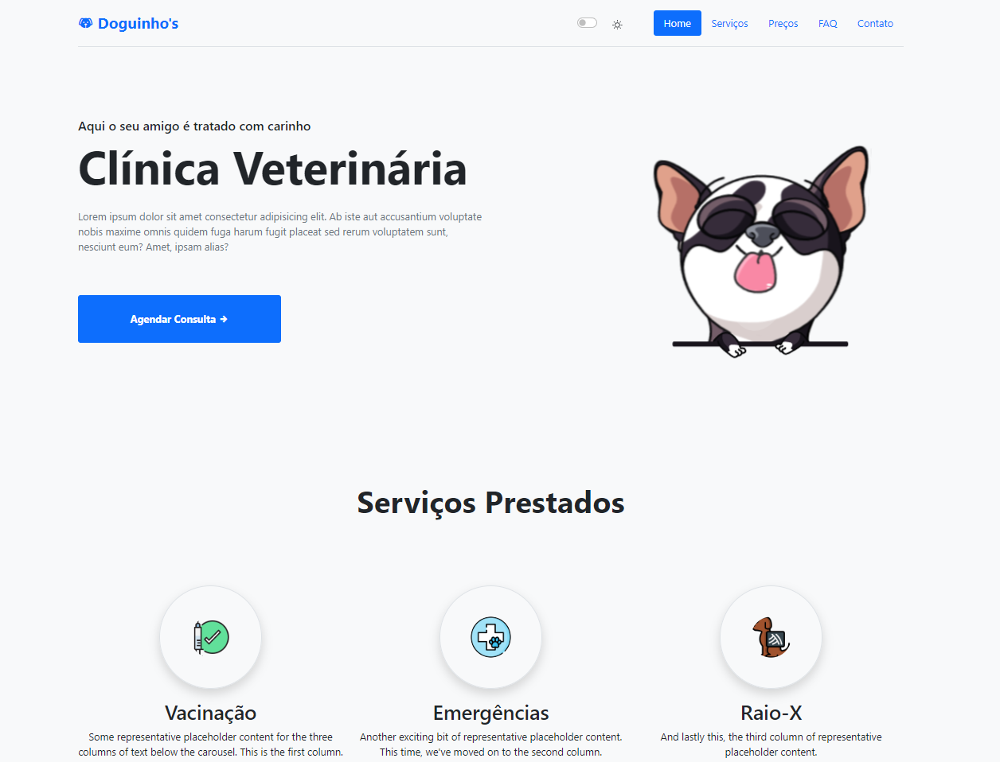

  

 

 

# 🐾 Doguinho's Clínica veterinária

Este projeto é um site desenvolvido para uma clínica veterinária, com o objetivo de proporcionar uma experiência online acessível e informativa para os clientes da clínica.
 

 
<h2 align="left"> 🚀 Tecnologias Utilizadas </h2>

- **HTML5** 
- **JavaScript** 
- **Bootstrap 5** 
 
 

## 📸 Prévia do Projeto

  

 

[Assista a Prévia do Projeto](https://www.youtube.com/watch?v=7MMB2GnYRlg)

  ## ✔️ Autora

- [LucieneFreitas](https://github.com/LucieneFreitas)

## 📄 Referência

- [Programação Web](https://curso.programacaoweb.com.br/)